# OneAquaHealth Citizen Science

A Flutter field guide that helps citizens make clear, useful observations of urban streams and pass that evidence to OneAquaHealth researchers.

**Watch the demo (3:33):** https://youtu.be/odeQ9dtsMA8

[](https://youtu.be/odeQ9dtsMA8)

## Try it

APK download: https://github.com/MI-TECHDLIN/onehealth-ui/releases/latest —
download the `.apk` file under **Assets**.

The three fictional bundled accounts share password `Ripple2026!`:

- `avery.current` or `avery.current@example.test`
- `sam.brook` or `sam.brook@example.test`
- `nuri.reed` or `nuri.reed@example.test`

Demo mode needs no sign-in: choose **Look around first** during onboarding.
Installation steps and the same test credentials are in
[`JUDGES-TEST-LOGINS.txt`](JUDGES-TEST-LOGINS.txt).

## Before / Now

The original citizen app exposed a long scientific form with raw research codes, limited guidance, English fallbacks inside partially translated flows, and registration before exploration. Network and server failures could also be difficult to interpret in the field.

This project keeps the original nine-step observation protocol and submission payload, but rebuilds the experience around the citizen doing the work:

- a five-part introduction explains One Health, field safety, and where observations go;
- a water-first map leads with human-readable stream names while preserving research codes as secondary information;
- one-question-at-a-time prompts add illustrations, plain-language coaching, glossary explanations, and a first-class “I’m not sure” path;
- drafts, offline queuing, photo and location checks, review, and a factual receipt make data collection easier to complete and understand;
- Ripple, the water mascot, guides rather than grades the citizen.

The redesign does not change the scientific protocol or claim that one report triggers an alert. It makes the existing protocol easier to learn, complete, and review.

## Features

- **Purpose before permissions:** five onboarding screens explain the problem, One Health, the field check, researcher use, and safe next steps before sign-in.
- **Safe Demo and Live modes:** Demo uses isolated local sites, history, drafts, and simulated submissions. Live authentication temporarily uses bundled fictional judge accounts while the preserved remote sign-in path is disabled; Live sites and submissions still use the production API. Mode remains visible and switchable in Settings.
- **Nine-step field protocol:** site selection; optional media; channel, bed, bank, habitat, debris, and flow observations; water and human alterations; left/right riparian observations; overall health; feelings; review and submit.
- **Field evidence checks:** in-app camera and gallery capture, on-device compression, suggestions for dark, overexposed, blurry, or obstructed photos, four evidence roles, GPS accuracy/distance confirmation, and an 11-item completeness meter. Optional evidence remains optional.
- **Offline-aware work:** the protocol is bundled, drafts persist locally, Demo works without a network, and failed Live submissions are queued with uploaded-file progress retained and retried after connectivity returns. Fresh Live site discovery and map tiles still require a network.
- **18 localized interfaces:** English, Greek, Portuguese, Dutch, Norwegian, French, Italian, Spanish, German, Polish, Romanian, Bulgarian, Turkish, Ukrainian, Arabic, Finnish, Swedish, and Croatian. Arabic uses right-to-left layout. Added machine-assisted protocol translations remain marked for native domain review.
- **Read aloud:** user-triggered Listen/Pause/Replay controls, word highlighting, and Ripple mouth cues use a bundled Piper `alba` English voice. Assessment locales without a generated recording use the device voice and say so in the control.
- **Understandable recovery:** plain-language sign-in, connection, timeout, and server messages replace raw status codes and exceptions.
- **Ethical motivation:** a weekly contribution rhythm with one grace week, five evidence badges, and factual post-submission receipts. There are no leaderboards, speed bonuses, upload rewards, or daily-only streaks.
- **Accessible by design:** semantic labels and reading order, non-colour-only states, large-text layouts, 48 dp targets, dark theme, reduced-motion states, and audio that never autoplays.
- **Map and personal record:** MapLibre with a light/dark OpenFreeMap water-first style, nearby/needs-data/visited filters, site details, personal stream timelines, saved drafts, queued checks, and submission receipts.

## Screenshots

The submission screenshots are produced with the demo video and live under `submission/video/screens/`. These links resolve when the `fm/oah-demo-video` work is merged:

| Screen | Preview |
|---|---|
| Onboarding: purpose and read-aloud | 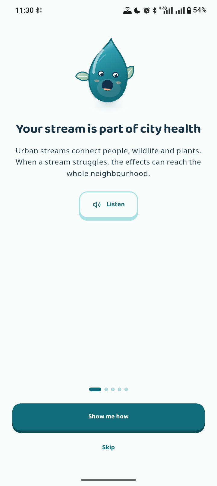 |
| Home: water-first stream map | 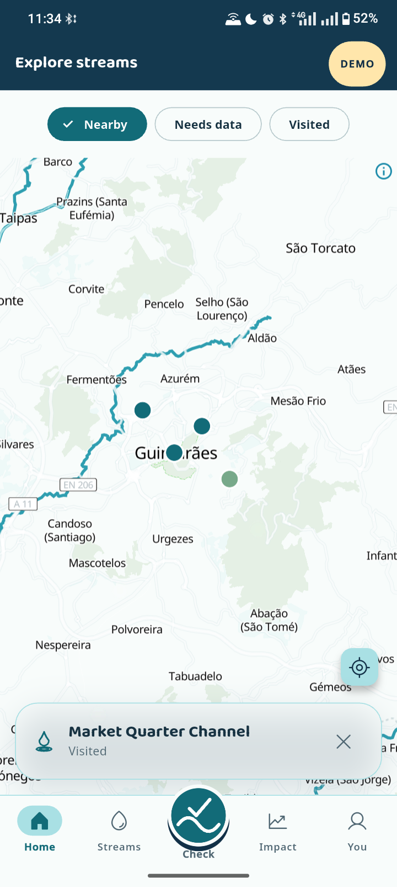 |
| Check: illustrated field question | 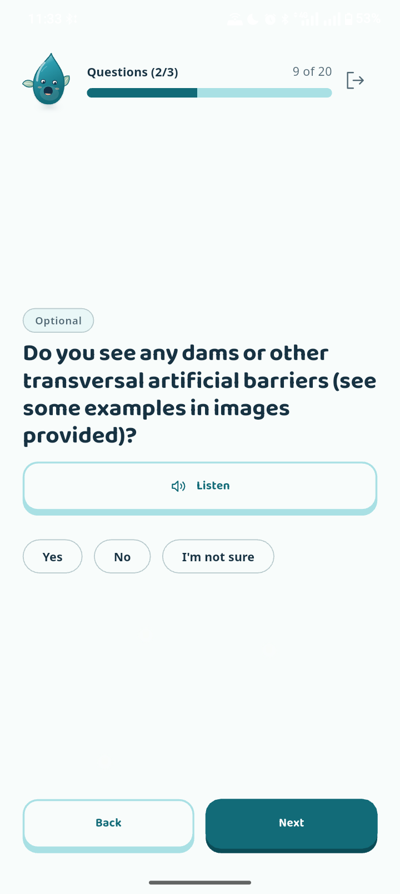 |
| Evidence: photo and GPS checks | 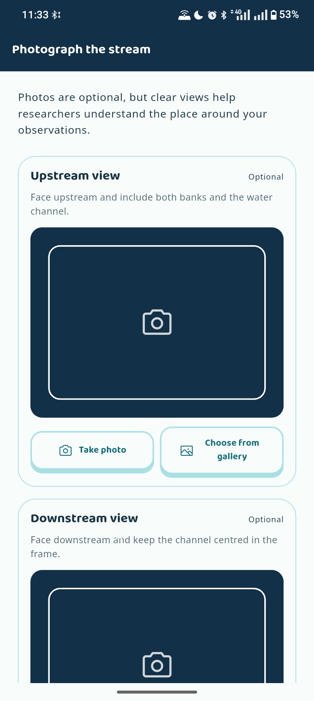 |
| Review: completeness and grouped answers | 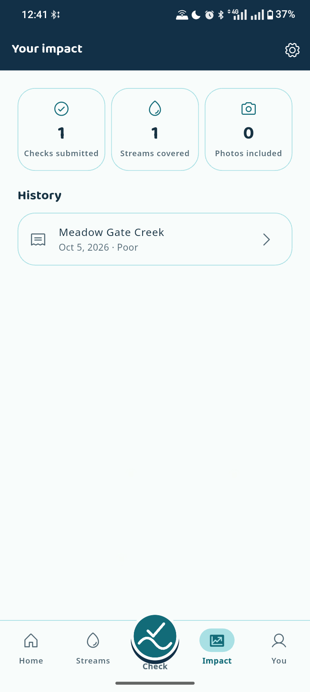 |
| Profile: weekly rhythm and evidence badges | 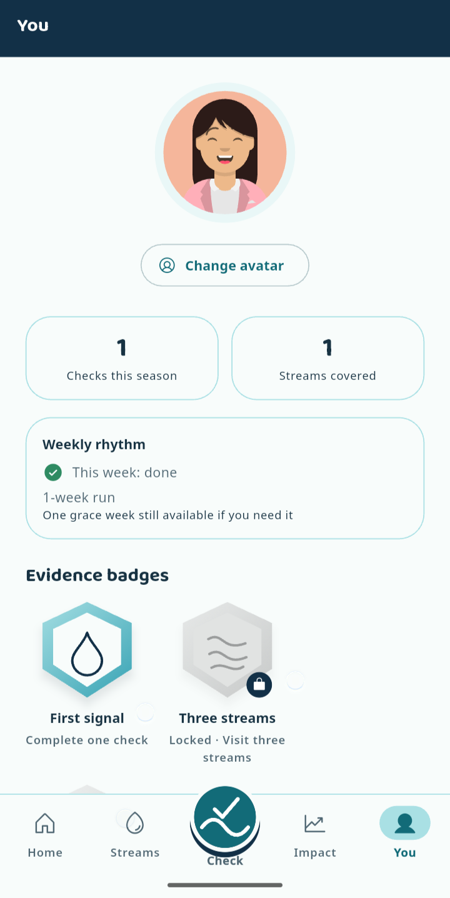 |

Expected files are `01-onboarding-purpose.png`, `02-home-map.png`, `03-field-question.png`, `04-evidence-checks.png`, `05-review.png`, and `06-profile-impact.png`. No placeholder or fabricated screenshots are stored in this branch.

### More screenshots

Real captures from the app on an Android phone (the only edit is removing the phone's touch-indicator dots).

<table>
  <tr>
    <td align="center" valign="top">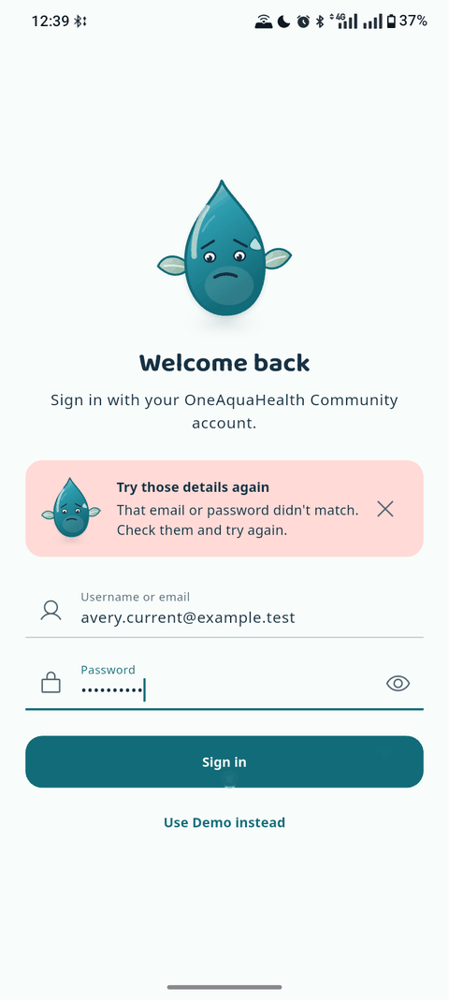<br><sub>Sign-in: a plain-language error</sub></td>
    <td align="center" valign="top">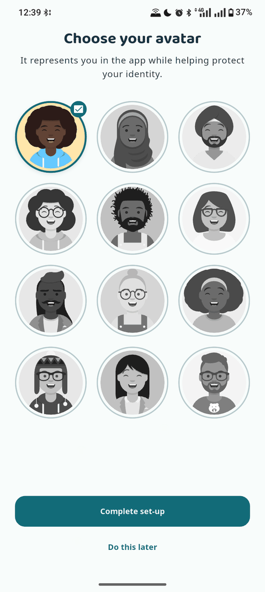<br><sub>Avatar picker</sub></td>
    <td align="center" valign="top">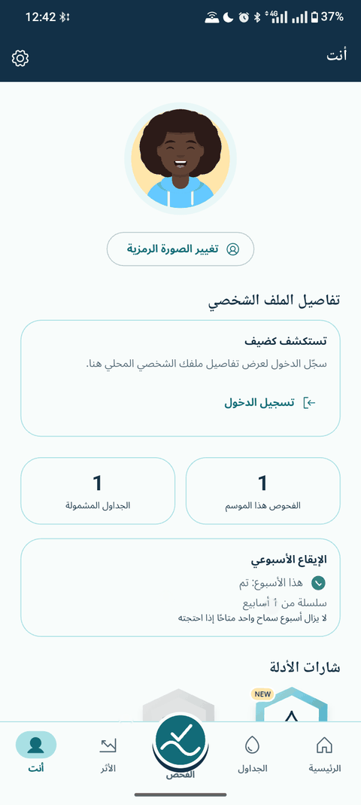<br><sub>Arabic, right to left</sub></td>
    <td align="center" valign="top">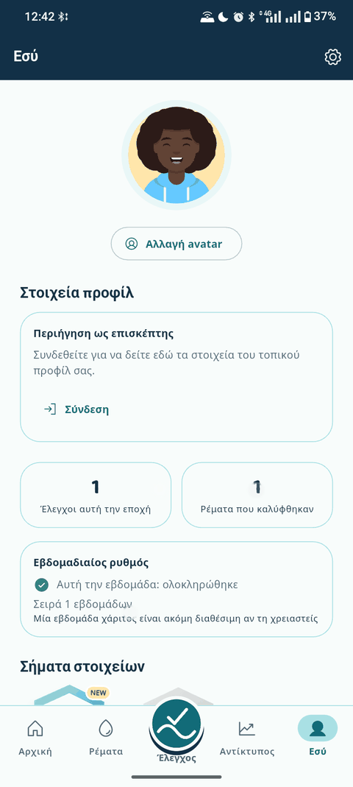<br><sub>Greek</sub></td>
  </tr>
  <tr>
    <td align="center" valign="top">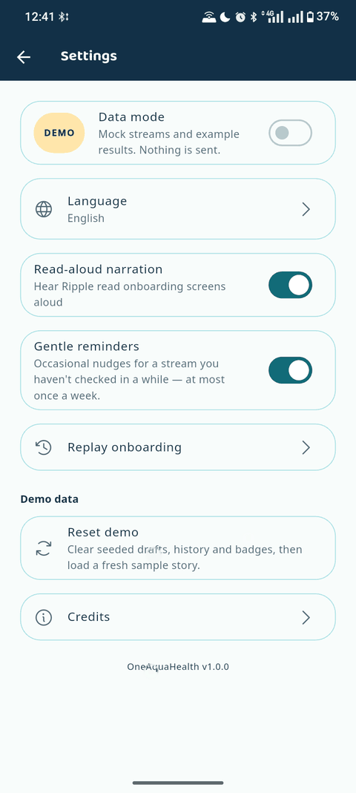<br><sub>Settings: Demo/Live, read-aloud, gentle reminders</sub></td>
    <td align="center" valign="top">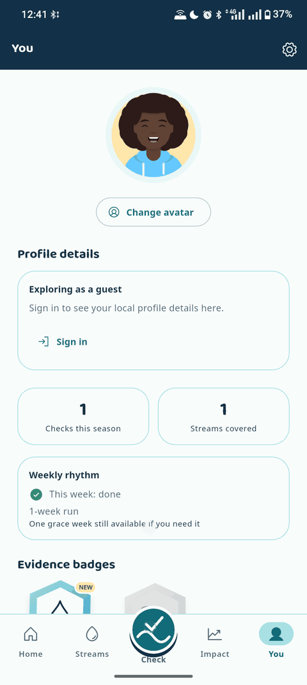<br><sub>Weekly rhythm and evidence badges</sub></td>
    <td align="center" valign="top">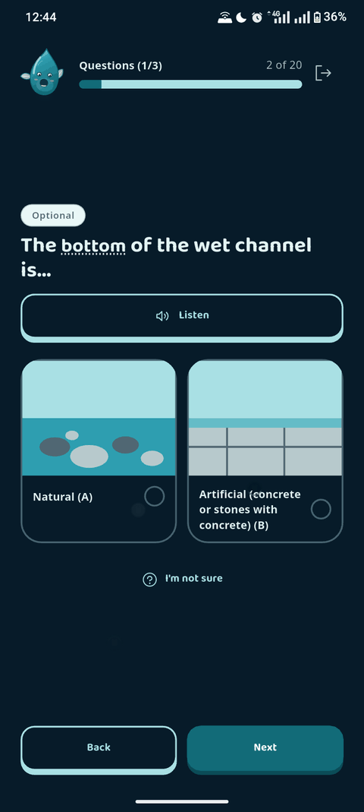<br><sub>Picture answers: channel bottom</sub></td>
    <td align="center" valign="top">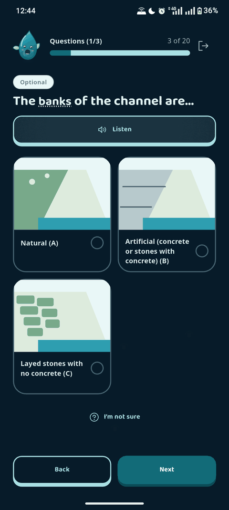<br><sub>Picture answers: banks</sub></td>
  </tr>
  <tr>
    <td align="center" valign="top">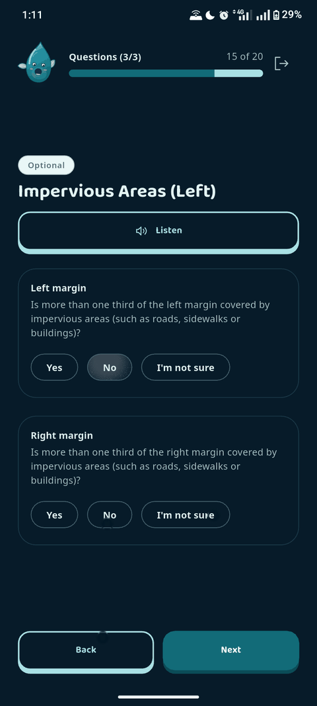<br><sub>Impervious areas: Yes / No / I’m not sure</sub></td>
    <td align="center" valign="top">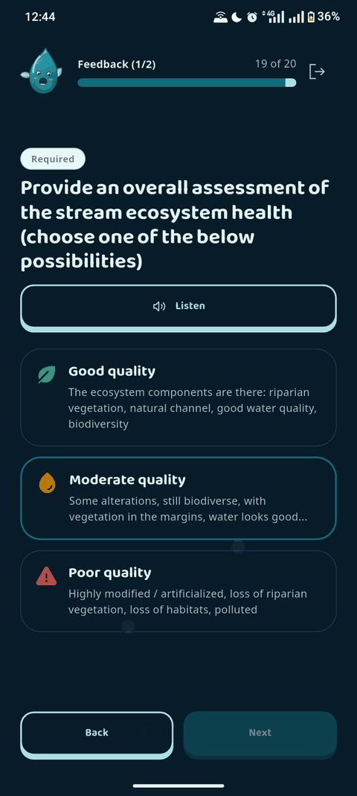<br><sub>Overall health (dark theme)</sub></td>
    <td align="center" valign="top">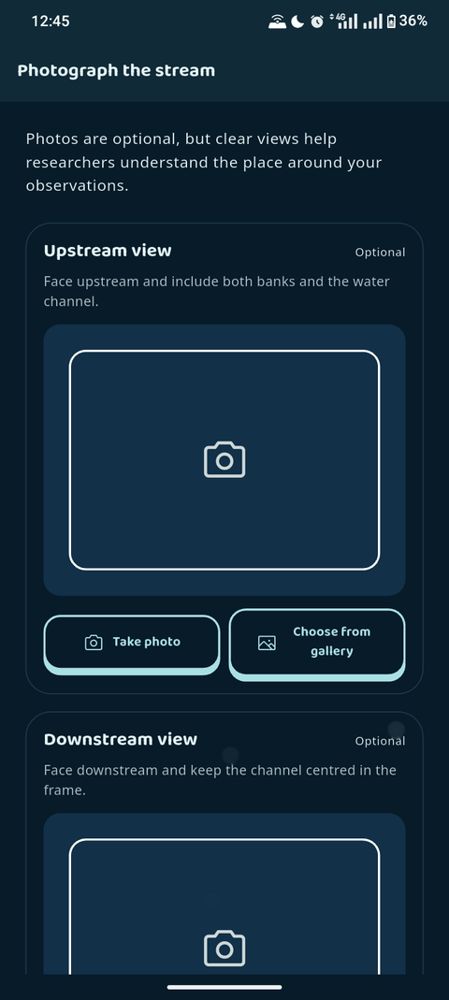<br><sub>Photograph the stream (dark theme)</sub></td>
    <td align="center" valign="top">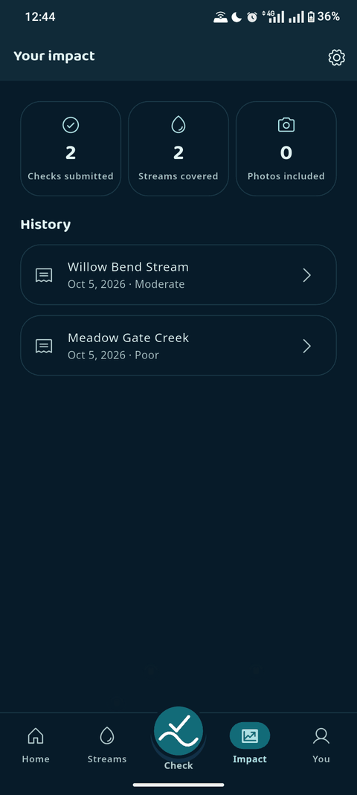<br><sub>Your impact (dark theme)</sub></td>
  </tr>
</table>

## Build and run

The project targets Flutter 3.41.7 stable with Dart 3.11.5.

```sh
flutter pub get
flutter gen-l10n
flutter run
```

For static checks and tests:

```sh
flutter analyze
flutter test
```

Camera, location, maps, notifications, and device text-to-speech are best reviewed on an Android or iOS device. The native MapLibre view is replaced with a test seam in widget tests.

## Demo walkthrough

1. Clear app data and launch. Demo mode is selected by default and the five-screen introduction opens.
2. Use **Listen** on an onboarding screen, then choose **Look around first**. Choose or skip an avatar.
3. On Home, inspect the map and switch between **Nearby**, **Needs data**, and **Visited**. Open a stream to see safety guidance and past checks.
4. Open **Streams** to see the seeded history and the saved Market Quarter Channel draft.
5. Start a stream check from **Check** or a site detail screen. Try an illustrated answer, “I’m not sure,” an underlined glossary term, and **Listen**.
6. Save and resume the draft, or continue through the protocol to the optional evidence screen. Photo analysis and the location check run on-device.
7. Review grouped answers and the completeness meter, submit in Demo, and read the evidence receipt.
8. Open **You** to see the weekly rhythm and evidence badges. **Settings → Reset demo** restores the original walkthrough data without touching Live data.

For the local sign-in walkthrough, choose **Get started** and use any one of
these fictional accounts (all use password `Ripple2026!`):

- `avery.current` or `avery.current@example.test`
- `sam.brook` or `sam.brook@example.test`
- `nuri.reed` or `nuri.reed@example.test`

Live mode is separate. Its temporary bundled accounts work offline and retain
their signed-in profile on the device. The remote sign-in implementation is
preserved behind the local authentication switch for later reactivation.

## Architecture

- [`lib/app/app_router.dart`](lib/app/app_router.dart) defines onboarding, authentication, the persistent five-destination shell, and the full-screen assessment routes.
- [`lib/features/`](lib/features/) contains onboarding, map/site detail, stream check, personal streams, profile, settings, and authentication UI.
- [`lib/data/repositories/`](lib/data/repositories/) separates Demo and Live implementations. `repository_bundle.dart` wires each mode; `assessment_repository.dart` owns local drafts, history, idempotent Live submission, and the retry queue.
- [`lib/data/assessment/assessment_protocol.dart`](lib/data/assessment/assessment_protocol.dart) turns bundled protocol content into typed questions and maps answers back to the submission contract.
- [`assets/data/assessment-content.json`](assets/data/assessment-content.json) is the localized protocol source.
- [`lib/core/`](lib/core/) contains shared theme tokens, localization, accessibility-aware motion, narration, friendly errors, mapping, notifications, gamification, and Ripple.
- [`test/`](test/) covers repository boundaries, protocol mapping, routing, localization, accessibility states, photo/GPS/completeness rules, offline queuing, and gamification logic. Native camera, location, MapLibre, and notification behavior remain part of the manual device checklist in [`docs/manual-qa.md`](docs/manual-qa.md).

Demo and Live use different storage namespaces for settings-sensitive data, drafts, history, queues, receipts, badges, and authentication. Tests use fake HTTP clients rather than the production service.

## Licences and credits

Third-party notices are also available in **Settings → Credits**:

- Piper `alba` English voice — CC BY 4.0; trained from Centre for Speech Technology Voice Cloning Toolkit recordings.
- Phosphor Icons — MIT License.
- Baloo 2 — SIL Open Font License 1.1.
- Avataaars by Pablo Stanley, remixed by DiceBear — free for personal and commercial use; DiceBear is MIT-licensed.
- Badge icons adapted from Lucide — ISC License.
- MapLibre GL — BSD 3-Clause License.
- OpenFreeMap / OpenMapTiles — map rendering and vector tiles; map data from OpenStreetMap contributors. Attribution remains visible in the map.
- Flutter camera — BSD 3-Clause; Flutter image picker — BSD 3-Clause / Apache 2.0; Dart image — MIT; connectivity_plus — BSD 3-Clause.

The repository does not currently declare a separate licence for original project code. Third-party licences do not grant a licence to that code.

## Team

**MI-TECHDLIN** — product design and Flutter implementation for the IEEE OneAquaHealth Hackathon, App UI/UX path (Track 1: Citizen Science UX).

## Submission material

- [Track alignment](submission/track-statement.md)
- [Project description](submission/project-description.md)
- [Devpost checklist](submission/checklist.md)
- [Demo video on YouTube](https://youtu.be/odeQ9dtsMA8)

Contributions follow the `feature/*` → `staging` → `main` flow and Conventional Commits described in [`CONTRIBUTING.md`](CONTRIBUTING.md).
